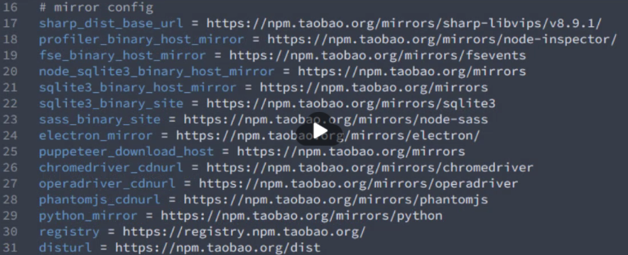

# 脚手架

- 相同的组织结构
- 开发范式
- 模块依赖
- 工具配置
- 基础代码

## yoeman

- install
  - `yarn global add yo`
  - `yarn global add generator-node` for node project, node generator
- usage
  - `yo node`
- sub generator
    - cli 应用
      - `yo node:cli`
      - `yarn` // install dependencies
      - `yarn link` // link globally
      - `module_name --help` run created cli app

### yeoman work flow

- 需求
- 找到合适的 generator
  - `yarn global add generator-webapp`
- 全局安装 generator
  - `yo webapp`
- 使用 yo 生成对应 generator
- 通过 cmd 填写项目配置
- 生成目录结构

- npm 二进制文件加速 - `mirror config`
  

### 自定 `generator` baseed on yeoman

- 本质是创建一个 npm 模块

- directory structure

  - **./generators/**
    - **app/** // default generator
      - **index.js** // implementation
    - **another_generator/**
      - **index.js**
  - **package.json**

- prepare
  - `mkdir generator-gName`
  - `cd generator-gName`
  - `yarn init`
  - `yarn add yeoman-generator` // base generator for other generator; provide tools function for creating generator
  - edit code-0
  - `yarn link`, // 使之成为全局 模块包
  - `$ mkdir project-name`
  - `$ cd project-name/`
  - `$ yo gName` // use gName generator in this project

**code-0**
```javascript
// app/index.js

// 此文件作为 Generator 的核心入口
// 需要导出一个继承自 Yeoman Generator 的类型
// Yeoman Generator 在工作时会自动调用我们在此类型中定义的一些生命周期方法
// 我们在这些方法中可以通过调用父类提供的一些工具方法实现一些功能，例如文件写入

const Generator = require("yeoman-generator");

module.exports = class extends Generator {
  writing() {
    // ------------------------------------------------------------------------
    // Yeoman 自动在生成文件阶段调用此方法

    // 我们这里尝试往项目目录中写入文件
    this.fs.write(this.destinationPath("temp.txt"), Math.random().toString());

    // ------------------------------------------------------------------------

    // ------------------------------------------------------------------------
    // 通过模板方式写入文件到目标目录

    // template file located in ./templates/foo.txt
    //  这是一个模板文件
    // 内部可以使用 EJS 模板标记输出数据
    // 例如：<%= title %>

    // 其他的 EJS 语法也支持

    // <% if (success) { %>
    // 哈哈哈
    // <% }%>

    // 模板文件路径
    const tmpl = this.templatePath("foo.txt");
    // 输出目标路径
    const output = this.destinationPath("foo.txt");
    // 模板数据上下文
    const context = { title: "Hello zce~", success: false };

    this.fs.copyTpl(tmpl, output, context);
    // ------------------------------------------------------------------------
  }

  // ------------------------------------------------------------------------
  prompting() {
    // Yeoman 在询问用户环节会自动调用此方法
    // 在此方法中可以调用父类的 prompt() 方法发出对用户的命令行询问
    return this.prompt([
      {
        type: "input", // user input
        name: "name", // key
        message: "Your project name",
        default: this.appname, // appname 为项目生成目录名称
      },
    ]).then((answers) => {
      // answers => { name: 'user input value' }
      this.answers = answers; // write to generator instance.answers
    });
  }

  writing() {
    // ./templates/bar.html
    // <!DOCTYPE html>
    // <html lang="en">
    // <head>
    //   <meta charset="UTF-8">
    //   <meta name="viewport" content="width=device-width, initial-scale=1.0">
    //   <meta http-equiv="X-UA-Compatible" content="ie=edge">
    //   <title><%= name %></title>
    // </head>
    // <body>
    //   <h1><%= name %></h1>
    // </body>
    // </html>

    // 模板文件路径
    const tmpl = this.templatePath("bar.html");
    // 输出目标路径
    const output = this.destinationPath("bar.html");
    // 模板数据上下文
    const context = this.answers;

    this.fs.copyTpl(tmpl, output, context);
  }
  // ------------------------------------------------------------------------
};
```

### vue-generator

```javascript
// index.js
const Generator = require("yeoman-generator");

module.exports = class extends Generator {
  prompting() {
    return this.prompt([
      {
        type: "input",
        name: "name",
        message: "Your project name",
        default: this.appname,
      },
    ]).then((answers) => {
      this.answers = answers;
    });
  }

  writing() {
    // 把每一个文件都通过模板转换到目标路径

    const templates = [
      ".browserslistrc",
      ".editorconfig",
      ".env.development",
      ".env.production",
      ".eslintrc.js",
      ".gitignore",
      "babel.config.js",
      "package.json",
      "postcss.config.js",
      "README.md",
      "public/favicon.ico",
      "public/index.html",
      "src/App.vue",
      "src/main.js",
      "src/router.js",
      "src/assets/logo.png",
      "src/components/HelloWorld.vue",
      "src/store/actions.js",
      "src/store/getters.js",
      "src/store/index.js",
      "src/store/mutations.js",
      "src/store/state.js",
      "src/utils/request.js",
      "src/views/About.vue",
      "src/views/Home.vue",
    ];

    templates.forEach((item) => {
      // item => 每个文件路径
      this.fs.copyTpl(
        this.templatePath(item),
        this.destinationPath(item),
        this.answers
      );
    });
  }
};
```

### 发布 generator

- create a remote git repository for holding source code
- `yarn publish --registry=https://registry.yarnpkg.com` in project root directory; `--registry` publish destination

## plop scaffold

- basic usage
  - `yarn add plop --dev`
  - `plop-templates/` // to store templates files for plop (`code-1`)
  - `plopfile.js` // plop entry file(`code-2`)
- to use customized plop generator
  - `yarn plop component` // use `component` generator defined in `plopfile.js` at project root directory
***
**code-1: templates**
```css
/* component.css.hbs */
.{{name}} {

}
```

```javascript
// component.hbs
import React from "react";

export default () => (
  <div className="{{name}}">
    <h1>{{ name }} Component</h1>
  </div>
);
```

```javascript
// component.test.hbs
import React from 'react';
import ReactDOM from 'react-dom';
import {{name}} from './{{name}}';

it('renders without crashing', () => {
  const div = document.createElement('div');
  ReactDOM.render(<{{name}} />, div);
  ReactDOM.unmountComponentAtNode(div);
});
```
***
**code-2: plop entry**
```javascript
// Plop 入口文件，需要导出一个函数
// 此函数接收一个 plop 对象，用于创建生成器任务

module.exports = (plop) => {
  // set generator name
  plop.setGenerator("component", {
    description: "create a component",
    prompts: [
      {
        type: "input",
        name: "name", // for configuring below actions
        message: "component name",
        default: "MyComponent",
      },
    ],
    actions: [
      // after cmd interaction
      {
        type: "add", // 代表添加文件
        path: "src/components/{{name}}/{{name}}.js",
        templateFile: "plop-templates/component.hbs",
      },
      {
        type: "add", // 代表添加文件
        path: "src/components/{{name}}/{{name}}.css",
        templateFile: "plop-templates/component.css.hbs",
      },
      {
        type: "add", // 代表添加文件
        path: "src/components/{{name}}/{{name}}.test.js",
        templateFile: "plop-templates/component.test.hbs",
      },
    ],
  });
};
```

## scarffold theory

- `yarn init`
- edit `package.json`
  - `{ "bin": "cli.js" ,}` // cli app entry file
- `yarn link`
- `project-name` // use this to execute cli comand

```javascript
// cli.js
#!/usr/bin/env node

// Node CLI 应用入口文件必须要有这样的文件头
// 如果是 Linux 或者 macOS 系统下还需要修改此文件的读写权限为 755
// 具体就是通过 chmod 755 cli.js 实现修改

// 脚手架的工作过程：
// 1. 通过命令行交互询问用户问题
// 2. 根据用户回答的结果生成文件

const fs = require("fs");
const path = require("path");
const inquirer = require("inquirer"); // yarn add inquirer
const ejs = require("ejs");

inquirer
  .prompt([
    {
      type: "input",
      name: "name",
      message: "Project name?",
    },
  ])
  .then((anwsers) => {
    // console.log(anwsers)
    // 根据用户回答的结果生成文件

    // 模板目录
    const tmplDir = path.join(__dirname, "templates");
    // 目标目录;
    const destDir = process.cwd(); // cwd(), 当前 cmd 执行目录

    // 将模板下的文件全部转换到目标目录
    fs.readdir(tmplDir, (err, files) => {
      if (err) throw err;

      files.forEach((file) => {
        // 通过模板引擎渲染文件
        ejs.renderFile(path.join(tmplDir, file), anwsers, (err, result) => {
          if (err) throw err;

          // 将结果写入目标文件路径
          fs.writeFileSync(path.join(destDir, file), result);
        });
      });
    });
  });
```